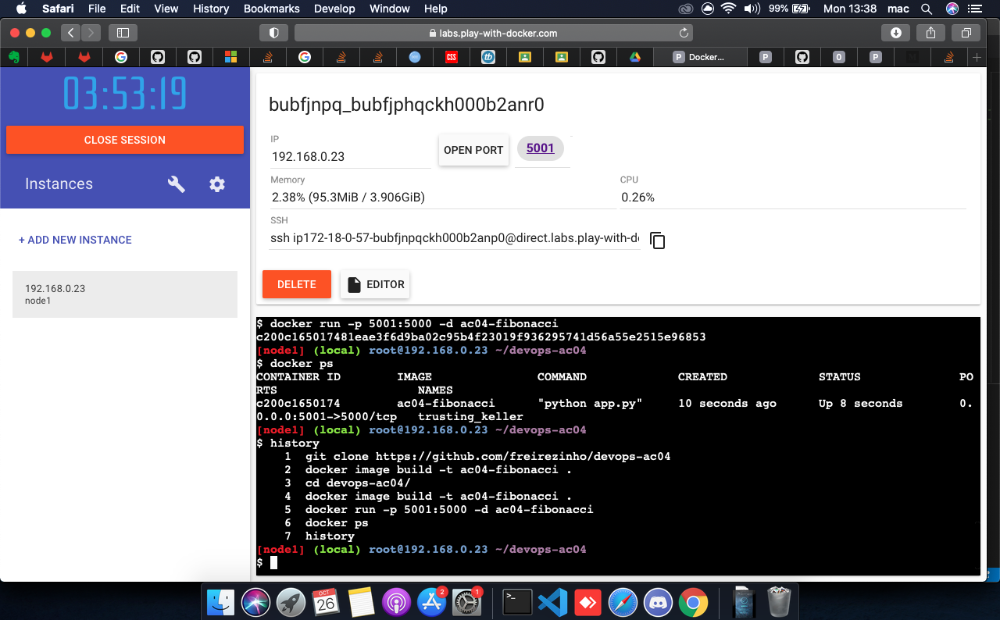
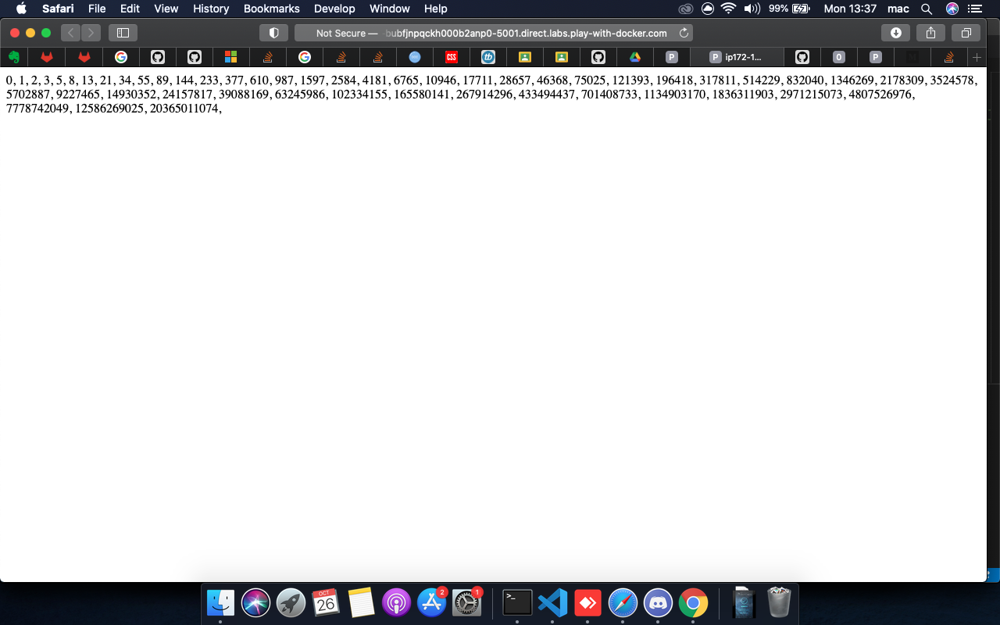

# AC 04 – Ambiente de Desenvolvimento e Operações

## Evidência do Histórico de Comandos (Docker Labs)
Comandos executados para construir a imagem e rodar o contêiner.

## Evidência do programa em Flask

Exibição da sequência de fibonacci como resposta da API em Flask.

